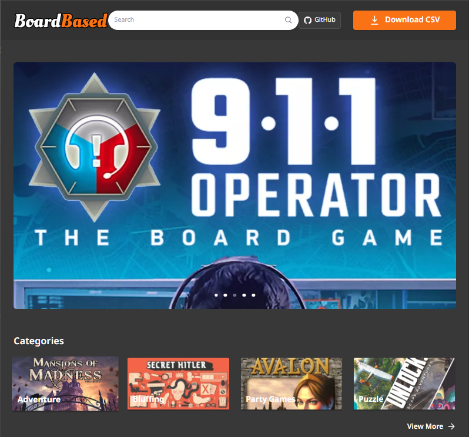
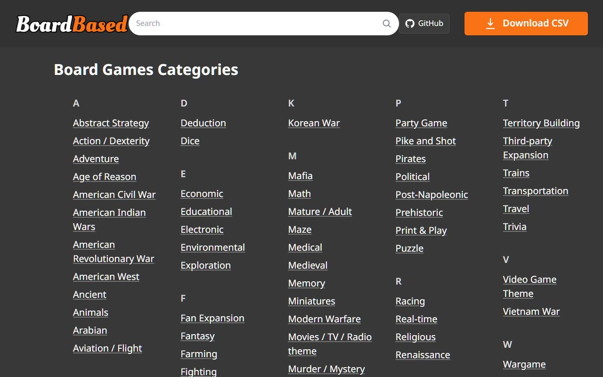

# BoardBased

A board-game discovery application built for KMITL's **Theory of Computation** course. Explore categories, browse game information, and work with a catalogue collected by Python crawlers.

**React · TypeScript · Node.js · Express · Sequelize · Python**

[Frontend](Frontend/) · [Backend](Backend/) · [Crawler](Crawler/) · [Original team repository](https://github.com/pakutonzz/BoardBased-App)

## Website preview



*Original homepage screenshot supplied by Ratha.*

<details>
<summary>View the category directory</summary>



*Original frontend running locally. Database-backed search was unavailable during capture.*

</details>

## Features

- Visual homepage and category directory.
- Game listing and detail views backed by an HTTP API.
- CSV export for catalogue data.
- Python crawler scripts and a bundled CSV dataset.

## Architecture

```text
Python crawlers → CSV → Import script → Database
                                           ↓
                                    Express API → React UI
```

| Component | Stack | Source |
| --- | --- | --- |
| Interface | React, TypeScript, Vite, Tailwind CSS | [Frontend](Frontend/) |
| API | Express, Sequelize | [Backend](Backend/) |
| Database | SQLite locally; PostgreSQL supported | [Configuration](Backend/config/db.js) |
| Data collection | Python | [Crawler](Crawler/) |

## Local setup

Install Node.js and npm compatible with the packages in both application directories. Python is only needed to run the crawlers; the bundled CSV is enough to try the app.

### 1. Clone

```bash
git clone https://github.com/RathaTart/BoardBased-App.git
cd BoardBased-App
```

### 2. Start the API

Create `Backend/.env`:

```dotenv
USE_SQLITE=true
SQLITE_PATH=./dev.sqlite3
PORT=3000
```

Then run:

```bash
cd Backend
npm install
npm run import:csv
npm start
```

The import creates model tables and loads `boardgame.csv`. Check [API health](http://localhost:3000/health).

### 3. Start the frontend

In [Frontend/vite.config.ts](Frontend/vite.config.ts), change the `/api` proxy target to `http://127.0.0.1:3000`. Keep the existing rewrite. The checked-in configuration points to a hosted backend.

From the repository root, in a second terminal:

```bash
cd Frontend
npm install
npm run dev
```

Open [BoardBased locally](http://127.0.0.1:8082/). Keep both terminals running.

## Commands

| Directory | Command | Purpose |
| --- | --- | --- |
| Backend | `npm start` | Start API |
| Backend | `npm run import:csv` | Import bundled data |
| Frontend | `npm run dev` | Start development UI |
| Frontend | `npm run build` | Build frontend |
| Frontend | `npm run preview` | Preview completed build |

## API

| Method | Path | Purpose |
| --- | --- | --- |
| GET | `/health` | Availability check |
| GET | `/board-games` | List and filter games |
| GET | `/board-games/:id` | Read a game |
| GET | `/board-games/export.csv` | Export CSV |
| POST | `/board-games` | Create a record |

See [routes](Backend/routes/board-games.js) and [controllers](Backend/controllers/) for parameters and validation.

## Troubleshooting

- **No games displayed:** check API availability, the imported database, and the frontend proxy target.
- **SQLite installation fails:** sqlite3 is a native dependency. Use a compatible Node.js version; native build tools may be needed when no prebuilt binary is available. The recent Node 24 Windows installation did not succeed.
- **Crawler setup:** inspect the scripts in [Crawler](Crawler/) before running them. No new crawl is required to use the bundled dataset.

## Team and attribution

This repository is a fork of a team coursework project. Features and screenshots represent shared team work, not one member's sole contribution.

### Members
```
66010840	สรศักดิ์ ลิ้มทอง
66011464	ราธา โรจน์รุจิพงศ์
66011437	พัฒน์กุลธร ชัยรัตน์
66010794	ศศิญากร จันทร์ศิริ
66010204	ณกุล เฉลิมชัยโกศล
66011377	ธนกร ฟูคูฮารา
66011428	พงศภัค ต๊ะต้องใจ
66011476	วัฒน์นันท์ ธีรธนาพงษ์
```

## Contributing

Open an issue describing the problem or suggestion. For code changes, include reproduction steps and verification results. Keep credentials and local databases out of commits.
